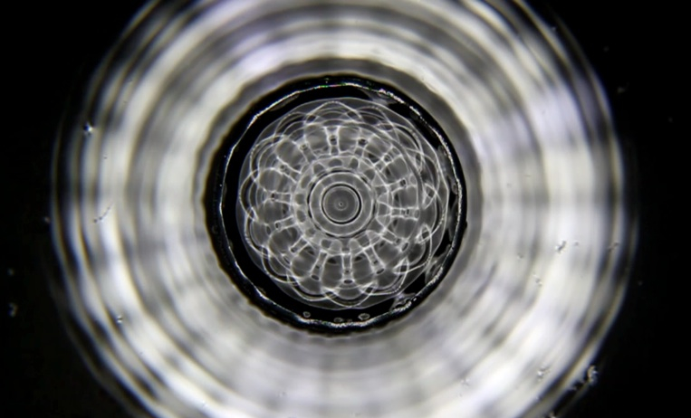
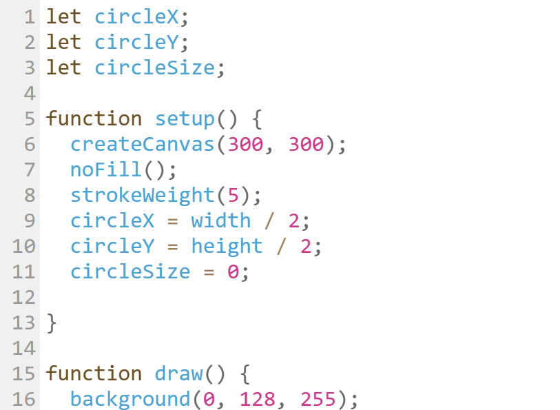
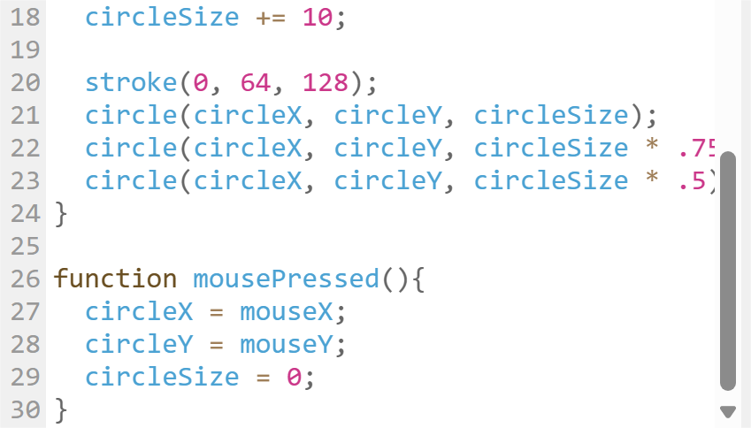

# Quiz8
## **Part 1: Imaging Technique Inspiration**
In our major project, our group has chosen to focus on _"Wheels of Fortune"_ by Pacita Abad. During this phase, I'm exploring two possibilities for this artwork: changing the size and amount of the wheels, or altering the patterns within the wheels.

### [__1.Human Sound Objects__ ](https://vimeo.com/170962832)
```
This is an interactive installation where ripples are created by sounds or the touch of participants. 
```


Inspired by how people interact with this artwork, I propose the size of the wheels in "Wheels of fortune" could change based on the loudness of sounds or users' behavior, and users could click on the canvas to add more wheels. 

The reason of chosing this technique is that it has the potential to accomplish the four animation methods in the assignment.
### [__2.Sonic water__](http://www.everydaylistening.com/articles/2013/6/22/sonic-water.html)
```
A great example of the visualization of sounds.
```



This project has inspired me with the idea that the patterns within the wheels can be rotating and live altered based on sound or user input.

The strength of this technique lies in preserving the original placement of all the wheels. This allows people to still recognize the original art pieces while experiencing vivid visual expressions.

## **Part 2: Coding Technique Exploration**
### [1. Code of Mouse Ripple](https://happycoding.io/tutorials/p5js/input/mouse-ripple)


We can incorporate this technique into the interactive part of our main project by replacing ripples with wheels. After a click, the wheels will remain on the canvas.




### [2. Polar Perlin Noise Loops](https://codepen.io/M0nica/pen/YzJgOGy)


Using Perlin Noise allows us to create the rotating wheels effect, giving them a hand-painted appearance due to their irregular shape. Further exploration should focus on learning how to change patterns within the wheels.

